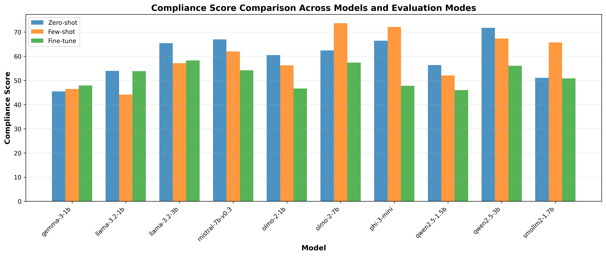
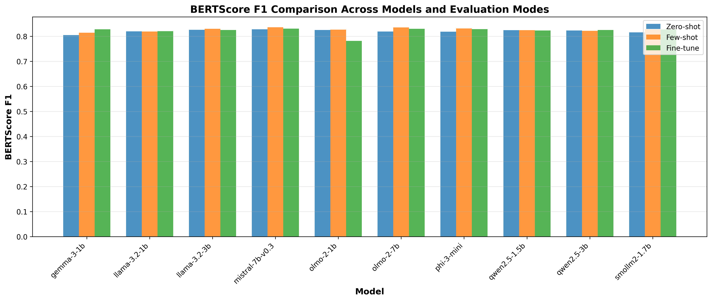

# Artifact Description: Exploring the Reasoning Depth of SLMs in Software Architecture

**Paper Title:** Exploring the Reasoning Depth of Small Language Models in Software Architecture: A Multidimensional Evaluation Framework Towards Software Engineering 2.0

**Conference:** International Conference on Software Architecture (ICSA 2026)

## 1. Overview

This artifact contains the replication package for the paper mentioned above. It includes the datasets, experimental results, and scripts required to reproduce the evaluation of Small Language Models (SLMs) on Architectural Decision Record (ADR) generation.

## 2. Directory Structure

```text
SLM-ArchBench/
├─ CHANGELOG.md
├─ INSTALL.md
├─ README.md
├─ example-pipeline/
│  ├─ config.py
│  ├─ evaluation.py
│  ├─ few_shot_prompt.txt
│  ├─ metrics.py
│  ├─ models.py
│  ├─ pipeline.py
│  ├─ preprocessing.py
│  ├─ requirements.txt
│  ├─ training.py
│  ├─ utils.py
│  ├─ datasets/
│  │  └─ ArchAI-ADR.csv
│  └─ test/
│     └─ test-model.py
├─ pipeline/
│  ├─ config.py
│  ├─ evaluation.py
│  ├─ few_shot_prompt.txt
│  ├─ metrics.py
│  ├─ models.py
│  ├─ pipeline.py
│  ├─ preprocessing.py
│  ├─ requirements.txt
│  ├─ training.py
│  ├─ utils.py
│  ├─ datasets/
│  │  └─ ArchAI-ADR.csv
│  └─ test/
│     └─ test-model.py
├─ result/
│  ├─ all_runs_summary.csv           # Combined results across all models and modes
│  ├─ few_shot_subset.csv            # Results: Few-shot experiments
│  ├─ fine_tune_subset.csv           # Results: Fine-tuned models (Metrics: ROUGE, BERTScore, etc.)
│  ├─ zero_shot_subset.csv           # Results: Zero-shot experiments
│  └─ pictures/
└─ result_visualization/
   ├─ draw_barchart_compilance.py
   ├─ draw_barchart_diversity.py
   └─ draw_barchart_f1.py
```

## 3. Pipeline Architecture

The evaluation pipeline follows a modular design with clear separation of concerns. Below is the data flow diagram:

```
┌─────────────────────────────────────────────────────────────────────────────────┐
│                              PIPELINE ORCHESTRATOR                              │
│                                 (pipeline.py)                                   │
└─────────────────────────────────────────────────────────────────────────────────┘
                                       │
                                       ▼
┌─────────────────────────────────────────────────────────────────────────────────┐
│                              CONFIGURATION                                      │
│                                (config.py)                                      │
│  ┌─────────────────┐  ┌─────────────────┐  ┌─────────────────┐                  │
│  │ MODEL_CANDIDATES│  │ TRAINING_ARGS   │  │ GENERATION_     │                  │
│  │ (10 SLMs)       │  │ (LoRA, epochs,  │  │ CONFIG          │                  │
│  │                 │  │  batch size)    │  │ (tokens, temp)  │                  │
│  └─────────────────┘  └─────────────────┘  └─────────────────┘                  │
└─────────────────────────────────────────────────────────────────────────────────┘
                                       │
         ┌─────────────────────────────┼─────────────────────────────┐
         ▼                             ▼                             ▼
┌─────────────────┐         ┌─────────────────┐         ┌─────────────────┐
│   ZERO-SHOT     │         │   FEW-SHOT      │         │   FINE-TUNE     │
│                 │         │                 │         │                 │
│ Pre-trained     │         │ K examples      │         │ LoRA training   │
│ model only      │         │ prepended to    │         │ on train set    │
│                 │         │ each prompt     │         │                 │
└────────┬────────┘         └────────┬────────┘         └────────┬────────┘
         │                           │                           │
         └────────────────────────────┬──────────────────────────┘
                                       ▼
┌─────────────────────────────────────────────────────────────────────────────────┐
│                              DATA PREPROCESSING                                 |
│                              (preprocessing.py)                                 │
│                                                                                 │
│   ArchAI-ADR.csv ──► preprocess_archai_adr() ──► {"prompt", "target"}           │
│   (context, decision)      Build instruction       Train/Test split             │
│                            prompts                 (80/20)                      │
└─────────────────────────────────────────────────────────────────────────────────┘
                                       │
                                       ▼
┌─────────────────────────────────────────────────────────────────────────────────┐
│                              MODEL LOADING                                      │
│                                (models.py)                                      |
│                                                                                 │
│   HuggingFace Hub ──► load_tokenizer_and_model() ──► 4-bit Quantization (QLoRA) │
│                       + LoRA adapter setup                                      │
└─────────────────────────────────────────────────────────────────────────────────┘
                                       │
                                       ▼
┌─────────────────────────────────────────────────────────────────────────────────┐
│                           TRAINING (Fine-tune only)                             |
│                               (training.py)                                     |
│                                                                                 │
│   Train Dataset ──► HF Trainer ──► LoRA Fine-tuning ──► Saved Model             │
│                     (10 epochs)    (r=16, α=32)        (models/{model_key}/)    │
└─────────────────────────────────────────────────────────────────────────────────┘
                                       │
                                       ▼
┌─────────────────────────────────────────────────────────────────────────────────┐
│                              EVALUATION                                         │
│                             (evaluation.py)                                     │
│                                                                                 │
│   Test Dataset ──► Model Generation ──► Collect Predictions                     │
│                    (max_new_tokens=256)                                         │
└─────────────────────────────────────────────────────────────────────────────────┘
                                       │
                                       ▼
┌─────────────────────────────────────────────────────────────────────────────────┐
│                              METRICS COMPUTATION                                │
│                                (metrics.py)                                     │
│                                                                                 │
│   ┌─────────────────────────────────────────────────────────────────────────┐   │
│   │ NLG Metrics          │ Research Metrics                                 │   │
│   ├──────────────────────┼──────────────────────────────────────────────────┤   │
│   │ • ROUGE-1/2/L        │ • Diversity Score (vocabulary richness)          │   │
│   │ • BLEU (SacreBLEU)   │ • Compliance Score (ADR structure adherence)     │   │
│   │ • METEOR             │ • Ripple Effect (P/R/F1 for consequences)        │   │
│   │ • BERTScore (P/R/F1) │                                                  │   │
│   └──────────────────────┴──────────────────────────────────────────────────┘   │
│                                                                                 │
│   Compliance evaluated via Gemini 2.5 Flash (LLM-as-Judge)                      │
└─────────────────────────────────────────────────────────────────────────────────┘
                                       │
                                       ▼
┌─────────────────────────────────────────────────────────────────────────────────┐
│                              RESULTS OUTPUT                                     │
│                                                                                 │
│   results/                                                                      │
│   ├─ all_runs_summary.csv          (combined metrics for all models & modes)    │
│   ├─ {model_key}/                                                               │
│   │   ├─ zeroshot_predictions.csv                                               │
│   │   ├─ fewshot_predictions.csv                                                │
│   │   └─ finetuned_predictions.csv                                              │
│   └─ {mode}_summary.csv            (per-mode aggregated results)                │
└─────────────────────────────────────────────────────────────────────────────────┘
```

### Module Responsibilities

| Module | Purpose   |
|--------|-----------|
| `pipeline.py`      | Main orchestrator: iterates over models and datasets, coordinates all modes                     |
| `config.py`        | Central configuration: model list, hyperparameters, LoRA settings, API keys                     |
| `models.py`        | Model/tokenizer loading with 4-bit quantization and LoRA adapter setup                          |
| `preprocessing.py` | Dataset-specific preprocessing, builds instruction prompts                                      |
| `training.py`      | Fine-tuning logic using HuggingFace Trainer with LoRA                                           |
| `evaluation.py`    | Generation and metric collection for all three evaluation modes                                 |
| `metrics.py`       | NLG metrics (ROUGE, BLEU, METEOR, BERTScore) + research metrics (Diversity, Compliance, Ripple) |
| `utils.py`         | Helper functions (parameter counting, component extraction)                                     |

## 4. Reproduction of Results (Detailed)

This section guides the reviewer to verify the key findings presented in **Section IV (Experimental Results)** of the paper.

Reviewers should compare the generated figures and the CSV data against the following claims made in the paper:

#### **Finding 1: The "Reasoning Gap" in Technical Compliance**

* **Claim:** Larger models (7B) significantly outperform smaller models (1B) in adhering to the ADR structure (Title, Status, Context, Decision, Consequences) in Zero-shot settings.
* **Verification:**
* Open `result/zero_shot_subset.csv`.
* Compare **Mistral-7b-v0.3** (`compliance_avg` ≈ **66.9**) vs. **Gemma-3-1b** (`compliance_avg` ≈ **45.4**).
* **Visual Check:** Inspect `result/pictures/compilance_score_comparison.png`. You should observe a distinct drop in the compliance bar for the 1B models compared to the 3B/7B models.



#### **Finding 2: Semantic Accuracy (BERTScore)**

* **Claim:** While structural compliance varies, semantic understanding (BERTScore F1) remains relatively competitive across models, though 7B models still lead.
* **Verification:**
* Open `result/fine_tune_subset.csv` (or Zero/Few-shot files).
* Observe that **Mistral-7b** achieves a BERTScore F1 of approximately **0.83**, whereas smaller models like **Llama-3.2-1b** hover around **0.82**.
* **Visual Check:** Inspect `result/pictures/bertscore_f1_comparison.png`. The variance between bars should be smaller than in the Compliance chart, indicating that 1B models are capable of generating semantically relevant text even if the structure is flawed.



#### **Finding 3: Impact of Prompting Strategies on Diversity**

* **Claim:** Fine-tuning tends to constrain the vocabulary diversity compared to Few-shot prompting.
* **Verification:**
* Compare `result/few_shot_subset.csv` vs `result/fine_tune_subset.csv`.
* Look at the `diversity_score_per_sample_avg` column.
* **Example:** **Gemma-3-1b** shows a diversity score of **0.463** in Few-shot, which changes to **0.382** in Fine-tuning. This shows that fine-tuning makes the model more "standardized".
* **Visual Check:** Inspect `result/pictures/diversity_score_comparison.png`.
